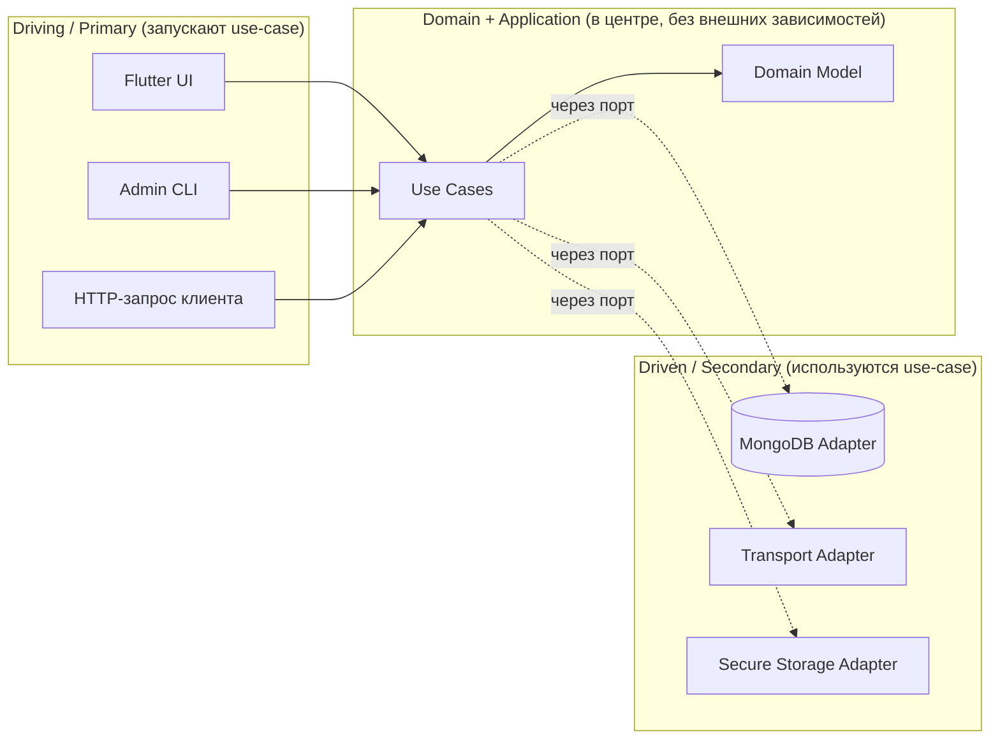
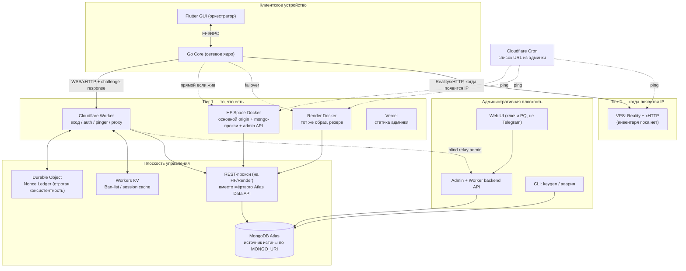
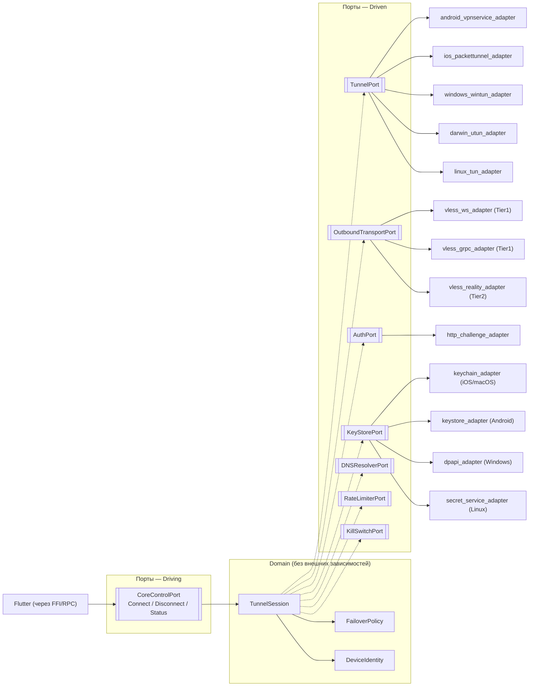
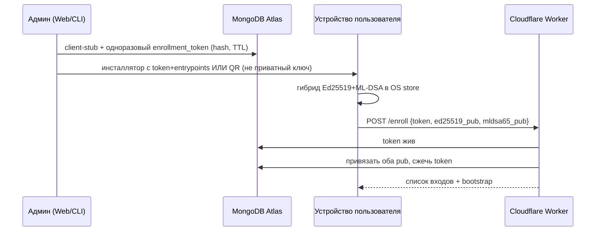
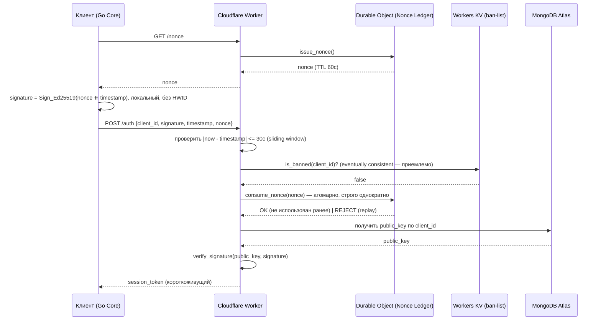

# Приватная VPN-система «Another» — техническая спецификация

> **Имя:** Another = «ещё один (VPN)» / «другой (VPN)». Принципы (кроссплатформенность,
> скорость, закрытый круг) — [`docs/principles.md`](principles.md). Карта документов —
> [`docs/README.md`](README.md).
>
> **Версии этого текста.** v2.0 — ревизия черновика «Свои» до кода. Ниже сохранены
> §0 (что было неверно в черновике) и исходная раскладка разделов. **Аудит 2026-08-25**
> изменил цели: админка не Telegram, HF Space — основной compute, Atlas Data API мёртв,
> TUN/Reality/PQ — обязательны, платформы релиза сужены. Эти решения **вписаны в
> соответствующие §**, детали — в отдельных документах, не в этом файле целиком:
> [план релиза](release-plan.md), [инфраструктура](infrastructure.md),
> [аутентификация](auth-spec.md), [провижининг](provisioning.md),
> [обход блокировок](circumvention.md), [монитор](observability.md),
> ADR [0003](adr/0003-web-admin-pq-auth.md)–[0008](adr/0008-hf-primary-node.md).
>
> **Код vs замысел (честно):**
> - UI (`app/`) — только английский; Flutter не прогонялся в среде агента (нет SDK).
> - `core/` v1 — ноль Go-зависимостей ([ADR 0001](adr/0001-zero-deps.md)); фаза 2
>   добавила circl (ML-DSA) и utls (Reality). TUN/NAT и kill switch — в коде;
>   живой драйвер — у оператора. VLESS wire-format свой ([ADR 0002](adr/0002-vless-reimplementation.md)).
>   Edge ходит в Mongo через REST-прокси. Telegram-бот в дереве, вне релиза.

---

## 0. О ревизии документа

Исходный документ — качественный концептуальный черновик с верным общим направлением (Go-ядро + Flutter, VLESS/Reality, бесплатная гео-распределённая инфраструктура). Но при проверке на «действительно ли это работает так, как описано» нашлось несколько мест, где написанное либо не будет работать как задумано, либо является уязвимостью, либо устаревшим фактом. Все они исправлены ниже. Раздел полноты (не хватало для того, чтобы по документу можно было писать код) — дополнен разделами 5–19.

### 0.1 Что было технически неверно или устарело

| # | Утверждение в черновике | Проверка | Исправление в этой версии |
|---|---|---|---|
| 1 | `HWID` = MAC-адрес интерфейса | На iOS/Android с ~2020 г. приложения не получают реальный MAC Wi-Fi (система отдаёт рандомизированный или заглушку), MAC также тривиально спуфится. Как идентификатор устройства — не работает. | Идентичность устройства = сгенерированная на устройстве пара Ed25519, хранящаяся в Keychain/Keystore/DPAPI. HWID как понятие убран. См. §11. |
| 2 | Anti-replay nonce хранится в Cloudflare **Cache API** (`caches.default`) | Cache API в Workers — кэш, привязанный к конкретному дата-центру (PoP), не имеет гарантий глобальной консистентности. Запрос, попавший в другой PoP в течение TTL, не увидит записанный nonce → replay-атака технически проходит. | Nonce-леджер перенесён на **Durable Objects** — единственный примитив Cloudflare с строгой консистентностью, подходящий для anti-replay. См. §7.2. |
| 3 | «Системный лимит памяти PacketTunnelProvider — 15 МБ» | По данным Apple DTS (форумы разработчиков), с iOS 15+ лимит для типа `packet-tunnel` — **~50 МБ** (15 МБ — для `app-proxy`/`DNS-proxy`, не для tunnel-провайдера). Лимиты не документированы официально и могут меняться между версиями/устройствами. | Цифра исправлена, добавлено предупреждение не хардкодить точное значение и тестировать на реальных устройствах. См. §5.2. |
| 4 | Hugging Face Spaces как штатный узел `sing-box` | Content Policy HF прямо запрещает «Proxies that are primarily designed to bypass restrictions imposed by the original service provider»; на практике HF уже банит такие Spaces (подтверждено обращениями в поддержку HF). Использование как основного узла — почти гарантированная блокировка аккаунта. | HF Spaces понижен до experimental/optional узла с явным риск-дисклеймером, предложена более устойчивая альтернатива. См. §8.2. |
| 5 | Пример кода Cloudflare Worker обращается к `ctx.waitUntil` внутри `handleRequest(request)`, где `ctx` не определён | Не скомпилируется — `ctx`/`env` передаются рантаймом только в сигнатуру `fetch(request, env, ctx)`. | Заменено на корректный псевдокод жизненного цикла обработчика. См. §7.4. |
| 6 | Reality упоминается как «целевой протокол» без явного разделения, где именно он работает | Reality требует полного контроля над сырым TLS ClientHello (uTLS-имитация браузера). Это невозможно внутри V8-изолята Cloudflare Workers — там нет доступа к TLS-рукопожатию на таком уровне, только `connect()` для сырого TCP к целевому хосту. Reality реализуем только там, где процесс имеет полноценный сетевой стек (VPS, Docker-контейнер) **и** стабильный IP, подобранный под SNI-донора. | Архитектура явно разделена на **Tier 1** (VLESS-WS/gRPC через Cloudflare Workers, bootstrap на бесплатных ресурсах) и **Tier 2** (VLESS-Reality на выделенном VPS — целевое состояние). См. §3, §9. |
| 7 | «Ротация Clean IP» описана как единственный механизм анти-бана, без учёта, что сам факт проксирования через Workers на нестандартный порт-донор — уже наблюдаемый паттерн | Не ошибка, а неполнота — не описан мониторинг деградации/детекта. | Добавлен раздел риск-мониторинга и деградации. См. §17. |
| 8 | Не описан онбординг устройства (как публичный ключ клиента вообще попадает в MongoDB) | Схема БД предполагает наличие `public_key`, но процесс его появления там не специфицирован — без этого систему нельзя реализовать. | Добавлен протокол первичной привязки устройства (enrollment). См. §7.1. |
| 9 | Отсутствует kill switch | Для VPN, чья единственная цель — устойчивость к DPI и защита трафика, отсутствие защиты от «слива» трафика при обрыве туннеля — критичный пробел. | Добавлен как обязательный компонент. См. §5.4. |
| 10 | Отсутствует учёт квоты (`quota_limit` есть в схеме, но нет механизма подсчёта трафика) | Без метеринга поле бессмысленно. | Добавлен алгоритм метеринга с батчевой синхронизацией. См. §8.4. |
| 11 | Не выбран однозначно движок между `xray-core` и `sing-box` | Оба упомянуты как «стандарт де-факто» без выбора — для спецификации, по которой пишут код, нужен один. | Выбран `sing-box` с обоснованием. См. §4. |
| 12 | Отсутствуют: гексагональная архитектура, файловая структура, наблюдаемость, тестирование, CI/CD, admin-интерфейс | Черновик — это, по сути, только «сетевой дизайн», не software-спецификация. | Добавлено полностью, разделы 2, 5–7 (файловая структура), 12–16. |

### 0.2 Что было верно и подтверждено поиском/проверкой

- Свободный тариф Render действительно «засыпает» через **15 минут** простоя, холодный старт **30–60 сек** — Pinger нужен, дизайн верный.
- Cloudflare Workers **умеют** открывать исходящие TCP-сокеты (`connect()` из `cloudflare:sockets`) — то есть VLESS-прокси прямо в Worker технически реализуем, это не миф.
- MongoDB Atlas M0: подтверждено — 512 МБ хранилища, **один M0-кластер на проект** (важно для дизайна окружений, см. §15).
- Идея с `RealiTLScanner` и подбором SNI-донора из той же подсети — стандартная и рабочая практика в комьюнити Reality/XTLS.
- Отключение ECH через Cloudflare API и верификация через `dns.google/resolve` — рабочий и корректный метод.

---

## 1. Цели, границы и модель угроз

**Цель системы:** приватный VPN для закрытой группы людей, которым оператор лично выдал доступ. Устойчивость к DPI (в первую очередь ТСПУ в РФ) на **той инфраструктуре, которая реально есть** ([infrastructure.md](infrastructure.md)). Два главных принципа: кроссплатформенность и скорость ([principles.md](principles.md)).

**Явные не-цели (Non-Goals):**
- Система **не** предоставляет анонимность уровня Tor. Оператор инфраструктуры технически видит метаданные.
- Система **не** публичный продукт и не магазинный VPN. ToS Cloudflare / Render / HF / Atlas это не переживут на масштабе «сервиса».
- Система не защищает от компрометации устройства (endpoint security вне скоупа).
- Система не работает при отсутствии интернет-пути (шатдаун, обрыв зарубежья).
- Постквантовая криптография **не** обещает защиту exe от декомпиляции.

**Модель угроз:**
- Основной противник — DPI/ТСПУ (сигнатуры, поведение потока, вайтлисты). Разбор: [circumvention.md](circumvention.md).
- Вторичный — чужой со спертым инсталлятором или спертым keystore. Invite-bound TOFU + бан + алерты, не ключ в бинарнике ([provisioning.md](provisioning.md)).
- Админ-канал — root: replay, подмена, гонки origin, чтение тел на TLS-терминаторе CF. Спека: [auth-spec.md](auth-spec.md).
- **Не** противник: MongoDB Atlas и наши Docker-origin. Cloudflare — не противник data-plane, но админ-команды шифруются **мимо** Worker (E2E к origin).
- HF Spaces: риск бана по ToS **принят** ([ADR 0008](adr/0008-hf-primary-node.md)).

---

## 2. Архитектурные принципы

Система строится по принципу **Hexagonal Architecture (Ports & Adapters)**, применённому на **каждом** независимо деплоящемся компоненте: клиентское ядро (Go), GUI (Flutter), edge-функция авторизации (Cloudflare Worker), административная плоскость (Python).

Правило зависимостей одно и то же везде: **Domain ничего не знает об Adapters.** Domain определяет только интерфейсы (Ports). Adapters реализуют порты и подключаются через Composition Root (main/wiring-файл) конкретной платформы.

Практический эффект для этого проекта: смена протокола обхода DPI, смена движка хранения nonce, смена origin (HF → другой Docker), смена админ-UI — это новый адаптер, без переписывания domain.



---

## 3. Общая системная архитектура

Архитектура явно разделена на два эксплуатационных уровня — это ключевая правка относительно черновика, где Tier 1 и Tier 2 были смешаны.

- **Tier 1 (то, что есть сейчас, $0/мес):** вход предпочтительно через Cloudflare Worker (часто вайтлист). Compute — **Hugging Face Space** (Docker, основной), резерв — Render (тот же образ, пингер с Worker). Worker не ходит в Mongo напрямую.
- **Tier 2 (обязателен по замыслу, VPS пока нет):** VLESS-Reality + xHTTP на выделенном IP. Terraform-модуль готовится заранее; провайдер — когда появится. Reality в Workers невозможен.

Клиент умеет работать с обоими уровнями и переключаться между узлами по политике failover (см. §5.3).



---

## 4. Технологический стек и обоснование

| Компонент | Технология | Почему |
|---|---|---|
| Клиентское сетевое ядро | **Go** | Единственный практичный выбор при жёстких лимитах памяти (§5.2) и требовании к производительности крипто/сети; экосистема `sing-box`/`xray-core` уже на Go. Python здесь неприменим — интерпретатор и GC не впишутся в лимиты extension-процесса и добавят задержку в hot path шифрования. |
| Прокси-движок | **sing-box** (вместо связки xray-core/sing-box без выбора) | Единая кодовая база, поддерживает VLESS/Reality/WS/gRPC/tun из коробки, активно поддерживается, конфиг декларативный (JSON), проще встраивать как библиотеку в Go-ядро, чем оборачивать xray-core. `xray-core` оставлен как референс/фallback в §9, если понадобится конкретная фича, которой пока нет в sing-box. |
| Кроссплатформенный GUI | **Flutter/Dart** | Сохранено из черновика — обосновано (единая кодовая база, хорошая производительность UI). |
| Edge-точка входа + авторизация | **TypeScript (Cloudflare Workers)**, опционально **Python Workers** | См. ADR в §7. Основной вариант — TS: минимальный cold start, зрелая поддержка WebCrypto/TCP Sockets API. Python Workers (Pyodide-based) — жизнеспособная, но новая опция с более высоким cold start; допустима, если для проекта принципиален единый Python-стек, — тогда это единственный сознательный компромисс между вашим предпочтением и требованиями задержки на hot path. |
| Anti-replay хранилище | **Cloudflare Durable Objects** | Строгая консистентность — обязательное требование для nonce-леджера (см. правку #2). |
| Кэш бан-листа / сессий | **Cloudflare Workers KV** | Eventually consistent приемлемо для бана (не security-critical по времени в пределах десятков секунд) и дешевле/быстрее Durable Object на чтение. |
| Источник истины по пользователям/устройствам | **MongoDB Atlas по `MONGO_URI`** | Data API / App Services EOL 2025-09-30. Worker ходит только в наш REST-прокси. |
| Основной origin | **Hugging Face Space (Docker)** | Самый мощный узел инвентаря; риск ToS принят. См. [ADR 0008](adr/0008-hf-primary-node.md), [infrastructure.md](infrastructure.md). |
| Резервный origin | **Render (тот же Docker-образ)** | Free tier спит — будит Cron Worker. Не основной compute (0.1 CPU). |
| Статика админки | **Vercel** (опционально тот же origin) | Не data-plane. |
| Целевой узел (Tier 2) | **VPS, пока нет в инвентаре** | Reality + xHTTP. Generic Terraform-модуль, не привязка к одному хостеру. |
| Подбор SNI-донора | **RealiTLScanner** (referenced tool, не переписывается) | Сохранено из черновика. |
| Административный CLI | **Python (Typer)** | keygen, авария, не основной UI. |
| Административный UI | **Web + backend API** (не Telegram) | [ADR 0003](adr/0003-web-admin-pq-auth.md), [observability.md](observability.md). |
| Криптография идентичности | **Ed25519 + ML-DSA-65** (гибрид) | [auth-spec.md](auth-spec.md), [ADR 0006](adr/0006-pq-hybrid-identity.md). PyNaCl только для classical-части CLI, пока нет PQ-биндинга. |
| Нагрузочное тестирование | **Locust (Python)** | Нагрузочные тесты на edge-auth endpoint и на data-plane. |
| Инфраструктура как код | **Terraform** (провайдер `cloudflare`) | Декларативное управление Workers/DNS/KV/DO/ECH-настройками — устраняет ручные `curl`-вызовы из черновика. |
| CI/CD | **GitHub Actions** | Свободный тариф, встроенная интеграция с `codeload.github.com`/`api.github.com`, достаточно для проекта такого масштаба. |
| Секреты | **Cloudflare Secrets Store** + **SOPS/age** для остальных окружений | Устраняет хранение `global_api_key`/строк подключения в открытом виде. |

### ADR-1: TS vs Python Workers для edge-auth
Auth-хендлер выполняется на каждое подключение клиента — это hot path. Тестирование Cloudflare показывает, что Python Workers (через Pyodide) существенно улучшили cold start к концу 2025 г., но всё ещё уступают нативным JS/TS Workers по стабильности задержки. **Рекомендация:** TS как основной адаптер порта `AuthHandlerPort`; Python Workers оставлен как документированная альтернативная реализация того же порта — переключение является заменой одного адаптера, а не переписыванием системы, что и демонстрирует ценность гексагональной архитектуры здесь.

### ADR-2: Cache API vs KV vs Durable Objects
- **Cache API** — отклонён для anti-replay (нет глобальной консистентности, см. правку #2).
- **KV** — eventually consistent (задержка репликации до значения TTL кэша) — неприемлемо для nonce, приемлемо для бан-листа.
- **Durable Objects** — строго консистентны, единственная верная точка для однопоточного счётчика/леджера nonce. Компромисс — дополнительный сетевой хоп и стоимость выше KV, но при масштабе «закрытая группа пользователей» это не проблема.

---

## 5. Go Core (клиентское сетевое ядро)

### 5.1 Домен, порты и адаптеры



### 5.2 Мост Flutter ↔ Go: платформенные различия (важная правка)

Черновик описывал единую модель «Flutter управляет жизненным циклом Go-процесса», но на мобильных ОС это физически невозможно: ни Android `VpnService`, ни iOS `PacketTunnelProvider` не позволяют приложению порождать произвольные дочерние процессы внутри extension-песочницы. Поэтому мост различается по платформе — это описывается двумя разными адаптерами одного и того же порта `CoreProcessPort` со стороны Flutter:

| Платформа | Модель | Механизм |
|---|---|---|
| Android / iOS | Go-ядро собирается как **библиотека** (`gomobile bind` → `.aar` / `.xcframework`) и линкуется прямо в процесс `VpnService`/`PacketTunnelProvider`. Отдельного процесса нет. | Dart `dart:ffi` → нативный биндинг → Go-библиотека внутри extension-процесса. |
| Windows / macOS / Linux | Go-ядро — отдельный **subprocess**, которым управляет Flutter (спавн/стоп/health-check). | Локальный IPC: JSON-RPC поверх Unix domain socket (macOS/Linux) или Named Pipe (Windows). |

Актуальный (не 15 МБ) лимит памяти для `packet-tunnel` extension на iOS 15+, по данным Apple DTS — **около 50 МБ**, но это не задокументировано официально Apple и менялось между версиями iOS. **Не хардкодить** это число в коде — тестировать на реальных устройствах/версиях ОС при каждом релизе (добавить в чек-лист CI, §15).

### 5.3 Псевдокод: подключение и failover между точками входа

```pseudocode
FUNCTION connect(profile):
    identity = KeyStorePort.load_or_create_device_identity()
    candidates = [Tier1.CloudflareWorker, Tier1.Render, Tier2.VPS_Reality]  // порядок из профиля
    FOR node IN candidates:
        TRY:
            session_token = AuthPort.challenge_response(node, identity)
            tunnel = OutboundTransportPort.dial(node, session_token)
            TunPort.bind(tunnel)
            KillSwitchPort.arm()                     // см. 5.4
            RateLimiterPort.attach(tunnel)
            EMIT StatusChanged(CONNECTED, node)
            RETURN success
        CATCH TransportError, AuthError AS e:
            LOG("node failed", node, e)
            CONTINUE  // пробуем следующий узел
    KillSwitchPort.arm()      // даже без соединения — не даём трафику течь мимо
    EMIT StatusChanged(FAILED)
    RETURN failure
```

### 5.4 Kill switch (отсутствовал в черновике — добавлен)

Обязательный компонент: при обрыве туннеля весь трафик, кроме служебного (переподключение/DNS к контроль-плоскости), должен блокироваться, а не идти в открытую сеть.

```pseudocode
STATE MACHINE KillSwitch:
    STATES: DISARMED, ARMED_CONNECTED, ARMED_BLOCKING

    ON connect_success:  ARMED_CONNECTED
        -> platform_adapter.allow_only(tunnel_interface)

    ON tunnel_dropped (while ARMED_CONNECTED):
        -> ARMED_BLOCKING
        -> platform_adapter.block_all_except(control_plane_endpoint)
        -> trigger reconnect_with_backoff()

    ON reconnect_success (while ARMED_BLOCKING):
        -> ARMED_CONNECTED

    ON user_disconnect:
        -> DISARMED
        -> platform_adapter.restore_default_routing()
```

Платформенная реализация `KillSwitchPort`: Windows — WFP (Windows Filtering Platform) правила + `route metric=1` для Wintun (сохранено из черновика); Android — `VpnService.Builder.setBlocking(true)` + запрет трафика вне tun; iOS — `includeAllNetworks` / `excludeLocalNetworks` политики `NEPacketTunnelNetworkSettings`; Linux — `nftables`/`iptables` правила, привязанные к жизненному циклу tun-интерфейса.

### 5.5 Файловая структура `/core`

```
core/
├── cmd/
│   ├── desktop/main.go            # composition root: subprocess + JSON-RPC сервер
│   └── mobilelib/binding.go       # composition root: gomobile-экспортируемые функции
├── internal/
│   ├── domain/
│   │   ├── session.go             # TunnelSession, состояния
│   │   ├── identity.go            # DeviceIdentity (Ed25519)
│   │   └── failover_policy.go
│   ├── ports/
│   │   ├── tunnel.go              # интерфейс TunnelPort
│   │   ├── transport.go           # интерфейс OutboundTransportPort
│   │   ├── auth.go                # интерфейс AuthPort
│   │   ├── keystore.go
│   │   ├── killswitch.go
│   │   └── ratelimiter.go
│   ├── adapters/
│   │   ├── tun/
│   │   │   ├── android_vpnservice.go
│   │   │   ├── ios_packettunnel.go
│   │   │   ├── windows_wintun.go
│   │   │   ├── darwin_utun.go
│   │   │   └── linux_tun.go
│   │   ├── transport/
│   │   │   ├── vless_ws.go
│   │   │   ├── vless_grpc.go
│   │   │   └── vless_reality.go
│   │   ├── auth/http_challenge.go
│   │   ├── keystore/{keychain,android_keystore,dpapi,secret_service}.go
│   │   ├── killswitch/{windows_wfp,android_block,ios_ne,linux_nft}.go
│   │   └── ratelimiter/token_bucket.go   # golang.org/x/time/rate
│   └── app/                       # use-cases: ConnectUseCase, DisconnectUseCase, SwitchNodeUseCase
├── go.mod
└── go.sum
```

---

## 6. Flutter GUI (оркестратор)

### 6.1 Домен, use-cases, порты/адаптеры

Домен: `VpnSessionState` (машина состояний Disconnected/Connecting/Connected/Reconnecting/Error), `Profile`, `NodeDescriptor`.

Порты: `CoreProcessPort` (driven, два адаптера — FFI для мобильных, subprocess-RPC для десктопа, см. §5.2), `ConfigRepositoryPort` (driven, обращается **только** к control-plane API, никогда напрямую к MongoDB), `SecureStoragePort` (driven, `flutter_secure_storage`), `TelemetryPort` (driven, опционален, см. §13).

Use-cases (driving-порт, вызывается из виджетов): `ConnectUseCase`, `DisconnectUseCase`, `ImportProfileFromQrUseCase`, `SwitchNodeUseCase`.

### 6.2 Файловая структура `/app`

```
app/
├── lib/
│   ├── domain/
│   │   ├── entities/{vpn_session_state.dart,profile.dart,node_descriptor.dart}
│   │   └── ports/{core_process_port.dart,config_repository_port.dart,secure_storage_port.dart}
│   ├── application/
│   │   └── usecases/{connect_usecase.dart,disconnect_usecase.dart,import_profile_usecase.dart}
│   ├── infrastructure/
│   │   ├── core_bridge/{ffi_core_adapter.dart,subprocess_rpc_core_adapter.dart}
│   │   ├── api/config_repository_http_adapter.dart
│   │   ├── storage/flutter_secure_storage_adapter.dart
│   │   └── qr/qr_import_adapter.dart
│   └── presentation/
│       ├── screens/{home,onboarding,node_picker,settings}/
│       └── widgets/
├── android/  ios/  windows/  macos/  linux/    # платформенные проекты + встроенные extension-таргеты
└── pubspec.yaml
```

---

## 7. Плоскость управления (Control Plane)

### 7.1 Онбординг устройства (отсутствовал в черновике — добавлен)



### 7.2 Challenge-Response аутентификация (исправлено — Durable Object вместо Cache API)



Псевдокод nonce-леджера как Durable Object (единственный писатель на объект — по определению DO — снимает гонки без блокировок):

```pseudocode
CLASS NonceLedgerDurableObject:
    STATE: used_nonces = Map<nonce, expiry>

    METHOD issue_nonce():
        nonce = crypto_random(16 bytes)
        used_nonces[nonce] = now() + 60s   // резервируем, ещё не "использован"
        RETURN nonce

    METHOD consume_nonce(nonce):
        purge_expired(used_nonces)
        IF nonce NOT IN used_nonces:
            RETURN REJECT   // не выдавался или истёк
        IF used_nonces[nonce].consumed == true:
            RETURN REJECT   // повторное использование — replay
        used_nonces[nonce].consumed = true
        RETURN OK
```

### 7.3 Бан-лист и отзыв ключей

```pseudocode
FUNCTION check_ban(client_id):
    cached = KV.get("ban:" + client_id)
    IF cached IS NOT NULL:
        RETURN cached.is_banned
    record = Mongo.find_client(client_id)
    KV.put("ban:" + client_id, record.is_banned, ttl=30s)   // cache-aside, короткий TTL —
    RETURN record.is_banned                                  // компенсирует eventual consistency KV

FUNCTION revoke_device(client_id):                            # вызывается из admin CLI/бота
    Mongo.update_client(client_id, is_banned=true)
    KV.delete("ban:" + client_id)   # форс-инвалидация локального узла, не ждём TTL
```

### 7.4 Файловая структура `/edge`

```
edge/
├── src/
│   ├── domain/
│   │   ├── challenge_response_service.ts   # чистая логика проверки, без Cloudflare API
│   │   └── ban_policy.ts
│   ├── ports/
│   │   ├── nonce_store_port.ts
│   │   ├── user_repository_port.ts
│   │   └── signature_verifier_port.ts
│   ├── adapters/
│   │   ├── durable_object_nonce_store.ts
│   │   ├── rest_proxy_user_repository.ts      # origin /internal/v1, ADR 0005
│   │   ├── pinger.ts                          # Cron: список URL из origin API
│   │   ├── mongo_atlas_user_repository.ts     # МЁРТВ (Atlas Data API EOL 2025-09-30)
│   │   ├── webcrypto_ed25519_verifier.ts
│   │   └── kv_ban_cache.ts
│   ├── handlers/
│   │   ├── enroll.ts        # POST /enroll — §7.1
│   │   ├── nonce.ts         # GET /nonce
│   │   ├── auth.ts          # POST /auth — §7.2
│   │   └── proxy.ts         # VLESS-WS данные, TCP Sockets API — §8.1
│   └── index.ts             # composition root: fetch(request, env, ctx)
├── python_variant/          # альтернативная реализация auth.ts на Python Workers, см. ADR-1
│   └── auth_worker.py
├── wrangler.toml
└── package.json
```

---

## 8. Data plane (узлы проксирования)

### 8.1 Tier 1: Cloudflare Worker как VLESS-WS шлюз

Подтверждено технически: Worker принимает WSS-соединение от клиента, парсит VLESS-заголовок, затем открывает исходящий TCP через `connect()` (`cloudflare:sockets`) напрямую к целевому хосту — то есть в Tier 1 Cloudflare выступает точкой выхода, а не просто транспортом до бэкенда. Важные ограничения платформы: сокеты нельзя создавать в глобальной области видимости (только внутри обработчика), исходящие TCP к IP-диапазонам самого Cloudflare заблокированы, каждый открытый сокет учитывается в лимите одновременных соединений Worker'а — эти лимиты нужно закладывать в failover-политику клиента (§5.3), а не считать Worker бесконечно ёмким.

### 8.2 Origin: Hugging Face Space (основной) и Render (резерв)

- **Hugging Face Space:** основной Docker-origin. 16 ГБ RAM, эфемерный диск до 50 ГБ после старта **не** является хранилищем. Content Policy HF запрещает такой use-case; оператор принимает риск бана ([ADR 0008](adr/0008-hf-primary-node.md)). Из РФ клиент по возможности не ходит на huggingface.co напрямую, а через Cloudflare Worker.
- **Render:** тот же образ, слабее CPU, sleep 15 мин — снимается пингером. Сомнителен как прямой вход из РФ.
- Оба узла проксируют друг друга. Пингер — список URL в админке, не хардкод.

Старый текст «HF только experimental, лучше не использовать» сохранён как исторический в §0.1 #4; **текущее** решение — обратное по роли, с тем же риском.

### 8.3 Pinger (сохранено, псевдокод вместо реального кода)

```pseudocode
SCHEDULED (cron: интервал из конфига, дефолт ~14 мин для Render):
    targets = AdminConfiguredPingList()   # не зашитый [Render]
    FOR node IN targets:
        response = fetch(node.ping_endpoint, timeout=5s)
        record_health(node, response.status)
```

### 8.4 Учёт квоты трафика (отсутствовал — добавлен)

Прямая запись в MongoDB на каждый пакет неприемлема по стоимости и задержке. Решение — локальный счётчик в Durable Object (по одному на активную сессию) с батчевым сливом:

```pseudocode
ON tunnel_data_transferred(client_id, bytes):
    DurableObject(client_id).counter += bytes
    IF DurableObject(client_id).counter_age > 60s OR counter > FLUSH_THRESHOLD:
        Mongo.increment(client_id, "clients.$.bytes_used", DurableObject(client_id).counter)
        Mongo.set(client_id, "clients.$.last_activity", now())
        DurableObject(client_id).counter = 0

ON auth_check(client_id):
    IF Mongo.find_client(client_id).bytes_used >= quota_limit:
        REJECT "quota exceeded"
```

---

## 9. Протоколы и анти-DPI техники

### 9.1 Tier 1 — VLESS over WS, затем xHTTP / gRPC
WS сохранён как уже написанный транспорт. К 2026 ТСПУ скорит **поведение** длинного TCP-туннеля; голый VLESS+Reality-over-TCP в части сетей РФ перестал быть достаточным. Поэтому следующий транспорт origin — **xHTTP** (split HTTP, похож на веб), затем gRPC. Разбор: [circumvention.md](circumvention.md). Пример WS-конфига ниже — не единственный и не «целевой навсегда».

```json
{
  "outbounds": [{
    "type": "vless",
    "tag": "tier1-cf",
    "server": "cf-worker.another.example",
    "server_port": 443,
    "uuid": "{device-bound-uuid}",
    "transport": { "type": "ws", "path": "/?ed=2048", "headers": { "Host": "cf-worker.another.example" } },
    "tls": { "enabled": true, "server_name": "cf-worker.another.example", "utls": { "enabled": true, "fingerprint": "chrome" } }
  }]
}
```

### 9.2 Tier 2 — VLESS-Reality: требования и почему это не Tier 1
Reality требует полного управления сырым TLS ClientHello (uTLS-имитация конкретного браузера) — это возможно только в процессе с полноценным сетевым стеком (VPS, обычный Docker-хост), а не в V8-изоляте Workers. Дополнительно Reality опирается на **стабильный** IP, географически/по подсети совпадающий с легитимным SNI-донором — свободные PaaS-платформы с ротацией IP этому требованию не удовлетворяют. Отсюда — жёсткая привязка Reality к VPS, как и было в черновике, но теперь с явным техническим обоснованием, а не просто «при переходе на VPS».

Подбор SNI-донора — `RealiTLScanner`, сканирование той же подсети/AS, что и VPS; запрет на дефолтные домены (google.com и т.п.) на облачных подсетях сохранён как критичное правило.

### 9.3 ECH: отключение и верификация (сохранено без изменений — метод корректен)
Отключение через Cloudflare API (`PATCH /zones/{zone_id}/settings/ech`) выполняется как часть Terraform-провижининга (§4), а не разовым ручным `curl`. Верификация — запрос к `https://dns.google/resolve?name={domain}&type=HTTPS` на отсутствие ECH-параметров в ответе.

---

## 10. Модель данных (MongoDB Atlas) — исправленная схема

Ключевые изменения относительно черновика: убран HWID/MAC (см. правку #1), добавлены поля для онбординга/квоты/отзыва, минимизированы собираемые данные.

```json
{
  "user_id": "uuid_v4",
  "comment": "Друг из Питера",
  "created_at": "2026-08-20T10:00:00Z",
  "clients": [
    {
      "client_id": "iphone_15_pro",
      "public_key_ed25519": "hex",
      "public_key_mldsa65": "hex",
      "enrollment_token_hash": null,
      "enrollment_expires_at": null,
      "is_banned": false,
      "quota_limit_bytes": 53687091200,
      "bytes_used": 0,
      "last_activity": "2026-08-20T14:00:00Z",
      "key_created_at": "2026-08-20T10:05:00Z",
      "key_revoked_at": null
    }
  ]
}
```

Индексы: уникальный по `clients.client_id`, TTL-индекс по `enrollment_expires_at` для автоочистки просроченных приглашений. Поле `comment` — единственное потенциально приватное поле; при повышенных требованиях к приватности хранить его в шифрованном виде (MongoDB Client-Side Field Level Encryption) — это прямое продолжение предупреждения из черновика «нельзя жертвовать анонимностью трафика ради необязательных болей в базе».

---

## 11. Модель безопасности

Идентичность устройства = гибрид Ed25519 + ML-DSA-65, ключи **рождаются на устройстве** при первом запуске (invite-bound TOFU). Приватные ключи не в инсталляторе и не на сервере. Подробности: [auth-spec.md](auth-spec.md), [provisioning.md](provisioning.md). HWID/MAC исключены.

Админ — те же алгоритмы, ключ в файле/OS, не localStorage; запросы с монотонным `seq` и `chain_head`, не таблица nonce и не блокчейн.

Управление секретами инфраструктуры: Cloudflare Secrets Store; `MONGO_URI` только в env origin; SOPS/age по желанию. Не `MONGO_DATA_API_KEY`.

Отзыв устройства — §7.3 плюс переиздание приглашения в админке. Origin API после
revoke дергает `POST /internal/ban-invalidate` на Worker (`EDGE_INTERNAL_URL`);
если URL пуст, остаётся TTL бан-кэша 30 с. CLI-revoke этот push не делает.

---

## 12. Административная плоскость (Python)

Не hot path. Telegram **не** является интерфейсом (снят с релиза). CLI и будущий Web — driving-адаптеры одного domain.

Целевой вид (фаза 1 в коде, без отдельного пакета):

```
control-plane-admin/          # CLI + FastAPI origin (`another_admin.api`) + каркас /admin/
                              # бот в дереве, не развивать
```

Отдельный репозиторий `control-plane-api/` не завёлся: origin живёт рядом с
domain. Полноценный SPA — позже; сейчас статика в `another_admin/api/static/`.

Монитор, логи, алерты: [observability.md](observability.md). Сборка инсталлятора — кнопка в админке (reissue) и публичный портал `/another/` (invite-код → GitHub Actions → zip), см. [user-portal-plan.md](user-portal-plan.md).

Псевдокод приглашения тот же (`create_invite`); вместо «бот шлёт QR в Telegram» — API отдаёт token/QR, UI показывает, опционально запускает per-client build с **встроенным token**, не с приватным ключом.

---

## 13. Наблюдаемость

Стриминг через наш стек не опираемся. Поллинг. Компактные события — capped collection в Mongo, не диск HF. Алерты в админке, не мессенджер. Полный текст: [observability.md](observability.md).

- **Go Core:** локальные логи на устройстве; на сервер — только то, что нужно для сессии/квоты, не чужие URL из туннеля.
- **Worker:** счётчики 4xx `/auth`, health, pinger.
- **Origin:** структурированные события без payload пользовательского трафика.

---

## 14. Тестирование

| Уровень | Инструмент | Что покрывает |
|---|---|---|
| Go unit-тесты | `go test` + моки портов | Domain и use-cases ядра независимо от адаптеров — ключевое преимущество гексагональной архитектуры. |
| Go contract-тесты | `go test` против реальных адаптеров (за флагом) | Что адаптер действительно реализует контракт порта. |
| Dart | `flutter_test`, `integration_test` | UI-состояния, use-cases. |
| Edge (TS) | `vitest` + `wrangler dev` | Логика challenge-response, включая сценарий replay-атаки против Durable Object эмулятора. |
| Python admin | `pytest` | CLI/бот use-cases, генерация ключей. |
| Нагрузочное | **Locust (Python)** | `/nonce` и `/auth` endpoints — проверка, что Durable Object не становится узким местом при количестве пользователей проекта. |
| E2E | Ручной чек-лист + CI-джоб на реальных эмуляторах | Полный цикл enroll → connect → kill-switch на обрыве → reconnect, на каждой целевой ОС перед релизом (актуально из-за недокументированных лимитов памяти iOS, §5.2). |

---

## 15. CI/CD, окружения, секреты, IaC

- **Окружения:** dev / staging / prod — раздельные Cloudflare-зоны и раздельные Atlas-проекты (напоминание: **один M0-кластер на проект** — это ограничение платформы, не решение архитектуры, поэтому dev/staging/prod физически не могут жить в одном Atlas-проекте на free tier).
- **CI/CD:** GitHub Actions — отдельные workflow для `core` (кросс-компиляция Go под 5 таргетов), `app` (Flutter build matrix), `edge` (`wrangler deploy`), `control-plane-admin` (публикация CLI как pip-пакета/бот как systemd-сервис).
- **IaC:** Terraform-модуль `infra/cloudflare` — Worker, DO/KV бindings, DNS, отключение ECH (замена ручного `curl` из черновика на декларативный `resource "cloudflare_zone_settings_override"`).
- **Секреты:** Cloudflare Secrets Store для Worker-окружения; SOPS/age-файлы в `infra/secrets/` для остального, расшифровка только в GitHub Actions через OIDC.

---

## 16. Полная файловая структура репозитория (монорепо)

```
another/
├── core/                     # §5.5
├── app/                      # §6.2
├── edge/                     # §7.4
├── control-plane-admin/      # §12
├── infra/
│   ├── cloudflare/           # Terraform
│   └── secrets/              # SOPS/age
├── docs/
│   ├── README.md             # карта документов
│   ├── architecture.md       # этот документ
│   ├── release-plan.md
│   ├── infrastructure.md
│   ├── auth-spec.md
│   └── adr/
├── .github/workflows/
│   ├── core-ci.yml
│   ├── app-ci.yml
│   ├── edge-deploy.yml
│   └── admin-ci.yml
└── README.md
```

---

## 17. Риски, ограничения и юридические/ToS аспекты

- **Hugging Face Spaces** — риск бана по ToS реален и **принят** (основной compute). Резерв — Render-клон образа.
- **Render и Cloudflare** формально не VPN-хостинг; держаться за малый масштаб закрытого круга.
- **Atlas Data API мёртв.** Без REST-прокси edge не ходит в базу.
- **Отсутствие анонимности от оператора** — осознанный компромисс.
- **Юрисдикция** — вне технического скоупа.
- **Деградация транспортов** — гонка с ТСПУ, не разовая настройка Reality. См. [circumvention.md](circumvention.md).

---

## 18. Дорожная карта

Актуальная очередь работ — [release-plan.md](release-plan.md), не календарь. Кратко:

1. REST-прокси к Mongo + admin API (иначе auth мёртв).
2. TUN / kill switch / маршрутизация на Win10/11, Linux, Android.
3. Сетка входов Worker↔HF↔Render; xHTTP; Reality в коде; PQ-идентичность.
4. Монитор, сборка инсталляторов, Terraform generic VPS.
5. Когда появится VPS — включить Tier 2 в прод.

Критерий «релиз» задаёт оператор, не дата.

---

## 19. Допущения (после аудита 2026-08-25)

1. Закрытый круг, не тысячи устройств. Иначе меняются стек, Atlas, ToS-риски.
2. Платформы релиза: Windows 10/11, Linux, Android. Win7/8 — best-effort. Без macOS/iOS. Без XP. [ADR 0007](adr/0007-platform-scope.md).
3. Админка — Web с PQ-ключами, не Telegram.
4. Инвентарь — [infrastructure.md](infrastructure.md). Нет VPS, пока не появится.
5. Flutter GUI оператор гоняет у себя; агент не делает это первым шагом.
6. Python на Worker hot path по-прежнему не основной путь (ADR в §4).

Исторические открытые вопросы v2.0 (бот vs Matrix, Python everywhere) закрыты аудитом.
